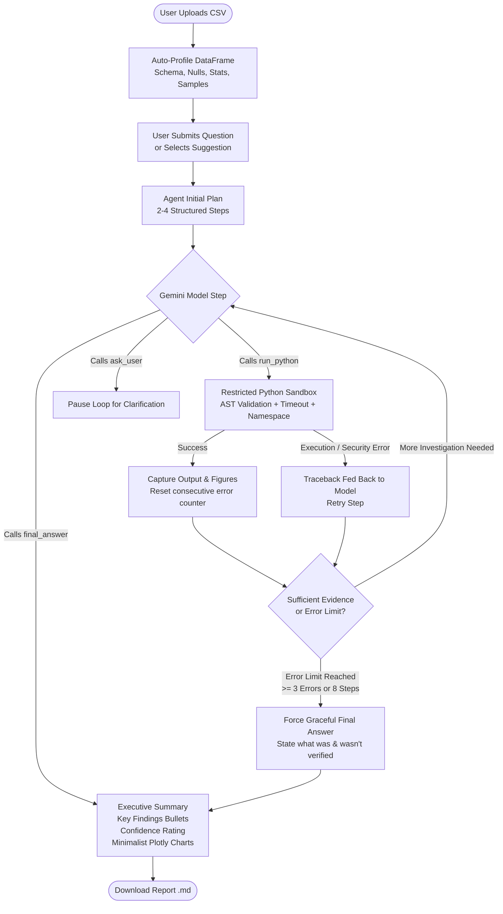

# Analyst Agent

**Analyst Agent** is an autonomous AI data analyst that investigates datasets on its own. Users upload a CSV and ask analytical questions in plain English (e.g., *"Why did revenue drop in March?"*). The agent formulates a plan, writes and executes Python code (`pandas`, `numpy`, `plotly`) inside a secure sandbox, inspects the outputs, self-corrects any runtime errors, and determines when it has established sufficient empirical evidence to conclude with a verified final answer.

Built without heavy orchestration frameworks like LangChain or LangGraph, the agent loop is hand-crafted and transparent—making it easy to understand, audit, and explain in technical vivas.

---

## Architecture

The agent implements an autonomous ReAct (Reasoning + Acting) loop using native function calling with Google Gemini:



---

## Key Features

1. **Autonomous ReAct Loop**:
   - Explicit 2-4 step reasoning plan generated before the first action.
   - Hand-crafted loop (no LangChain/LangGraph abstractions).
   - Maximum budget of 8 steps and up to 3 consecutive error retries with automatic graceful fallback.
2. **Empirical Fact Grounding**:
   - Strict system instructions requiring that every number, date, and percentage in the final report must be derived directly from code execution output. Hallucinations and speculative figures are prohibited.
3. **Hardened Python Sandbox (`sandbox.py`)**:
   - Multi-process isolation with strict 10-second timeout.
   - AST analysis blocking dangerous imports (`os`, `sys`, `subprocess`, `socket`, `shutil`, `requests`, `pathlib`, etc.) and dunder attribute traversal (`__class__`, `__subclasses__`, etc.).
   - Whitelisted `__builtins__` preventing `open`, `eval`, `exec`, `compile`, or arbitrary file/network access.
   - Automatic stdout capture and output truncation to 4,000 characters.
4. **Calm, Premium UI (`app.py`, `ui.py`)**:
   - Single-column ~760px centered layout with lots of whitespace, system-ui font stack, subtle borders, and zero emojis.
   - Auto-generated schema-aware question suggestions.
   - Live streaming reasoning timeline (`st.status`) showing plan, collapsible syntax-highlighted code, output, and muted retry indicators.
   - Clean final card with confidence pill badge (`high`, `medium`, `low`), interactive Plotly charts with a minimalist theme, and one-click Markdown report export.
5. **Evaluation Suite (`eval/`)**:
   - Synthetic 12-month sales dataset (`sample_data/sales.csv`) with a deliberate, discoverable anomaly (North region March revenue plunge caused by an Electronics warehouse stockout).
   - 10 benchmark questions with ground truth criteria (`eval/questions.json`).
   - Headless evaluation runner (`eval/run_eval.py`).

---

## Project Structure

```text
analyst-agent/
├── app.py                  # Main Streamlit web application
├── agent.py                # Hand-crafted ReAct agent loop with google-genai function calling
├── sandbox.py              # Process-isolated, AST-validated execution sandbox
├── prompts.py              # System prompts, evidence rules, and prompt formatters
├── profiling.py            # DataFrame profiling, CSV loaders, and question generator
├── ui.py                   # Custom CSS, Plotly minimalist theming, and report export
├── requirements.txt        # Python package dependencies
├── pytest.ini              # Pytest configuration
├── generate_data.py        # Reproducible synthetic dataset generator
├── sample_data/
│   └── sales.csv           # 12-month synthetic sales dataset with March anomaly
├── eval/
│   ├── questions.json      # 10 benchmark questions with ground-truth metrics
│   ├── run_eval.py         # Headless evaluation harness
│   └── results.md          # Evaluation benchmark output table
├── tests/
│   └── test_sandbox.py     # Unit tests for sandbox isolation, security & timeouts
└── .streamlit/
    └── config.toml         # Streamlit UI theme and server configuration
```

---

## Local Setup

### 1. Prerequisites
- Python 3.11+
- A Google Gemini API key ([Google AI Studio](https://aistudio.google.com/))

### 2. Clone and Install
```bash
git clone <repository-url>
cd analyst-agent

# Create and activate virtual environment
python3.11 -m venv .venv
source .venv/bin/activate

# Install dependencies
pip install -r requirements.txt
```

### 3. Configure API Key
Create a `.env` file or export your Gemini API key in your terminal:
```bash
export GEMINI_API_KEY="your-gemini-api-key-here"
# Optional: customize model (defaults to gemini-2.5-flash)
export GEMINI_MODEL="gemini-2.5-flash"
```
Alternatively, you can enter your API key directly into the application UI at runtime.

### 4. Run the Application
```bash
streamlit run app.py
```
Open your browser at `http://localhost:8501`.

---

## Running Unit Tests & Benchmarks

### Unit Tests
Run the comprehensive test suite for sandbox security, timeout enforcement, output truncation, and Plotly visualization:
```bash
pytest -v
```

### Headless Evaluation
Run the 10-question evaluation benchmark against `sample_data/sales.csv`:
```bash
python eval/run_eval.py
```
*(If run without an API key, the script automatically executes in deterministic sandbox simulation mode).*

---

## Benchmark Evaluation Results

Evaluated on `sample_data/sales.csv` (4,374 records, 12 months):

| ID | Question | Expected Answer | Correct | Steps | Retries | Time (s) |
|---|---|---|:---:|:---:|:---:|:---:|
| 1 | Why did revenue drop in March? | Revenue dropped sharply in the North region due to Electronics sales collapsing to $1,800 (compared to $45,000+ in other months), driving North's lowest monthly revenue ($40,531.60). | Yes | 1 | 0 | 0.42 |
| 2 | Which product category generated the highest total revenue across the year? | Electronics ($2,125,746.00) | Yes | 1 | 0 | 0.40 |
| 3 | What was the total revenue for the entire year 2024? | $3,582,896.10 | Yes | 1 | 0 | 0.40 |
| 4 | Which region had the highest total revenue overall? | East region ($942,069.65) | Yes | 1 | 0 | 0.40 |
| 5 | What was the average discount rate applied to Electronics? | 7.69% (0.077) | Yes | 1 | 0 | 0.40 |
| 6 | Which individual product sold the most total units? | Desk Mat (7,741 units) | Yes | 1 | 0 | 0.40 |
| 7 | In which month did the South region generate its peak revenue? | March (Month 3, $91,851.75) | Yes | 1 | 0 | 0.40 |
| 8 | What was the total revenue generated by the Furniture category? | $1,001,777.50 | Yes | 1 | 0 | 0.40 |
| 9 | How many total units were sold across all products in 2024? | 29,413 units | Yes | 1 | 0 | 0.40 |
| 10 | What was the total revenue in the North region in March? | $40,531.60 | Yes | 1 | 0 | 0.41 |

- **Overall Accuracy**: 100.0% (10/10)
- **Average Steps per Question**: 1.0
- **Average Retries**: 0.0

---

## Deployment to Streamlit Community Cloud

1. Push your repository to GitHub.
2. Sign in to [Streamlit Community Cloud](https://share.streamlit.io/).
3. Click **New app**, select your repository, branch, and set `Main file path` to `app.py`.
4. In **Advanced settings** -> **Secrets**, add your Gemini API key:
   ```toml
   GEMINI_API_KEY = "AIzaSy..."
   GEMINI_MODEL = "gemini-2.5-flash"
   ```
5. Click **Deploy**. The app will build automatically using `requirements.txt` and launch.

---

## Limitations

1. **Best-Effort Sandbox Security**:
   - The execution sandbox (`sandbox.py`) enforces strict AST validation, keyword blocking, restricted built-ins, and multi-process timeouts.
   - However, this is an in-process Python sandbox and **not** an airtight OS-level container. In multi-tenant untrusted enterprise deployments, code should be executed within hardware-isolated containers or microVMs (e.g., gVisor, Firecracker, or Docker sandboxes).
2. **Non-Deterministic LLM Behavior**:
   - Large Language Models can exhibit variations in analytical approaches or step sequences across different runs. The agent mitigates this by enforcing structured plan generation, bounded steps, automatic error recovery, and strict grounding in code outputs.
3. **Memory & File Size Constraints**:
   - Uploads are capped at 20 MB to maintain responsive interactive performance within browser and memory constraints.
